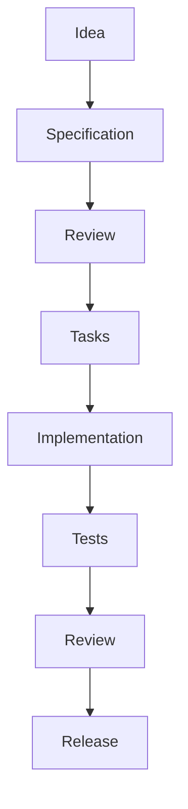

# Nexo

## 1. Propósito

Este documento establece la visión general de Nexo y define los principios de negocio, producto y desarrollo que gobiernan todas las especificaciones del proyecto. Ninguna especificación puede contradecir este documento.

Nexo es una plataforma SaaS multi-tenant para la gestión integral de Recursos Humanos. Centraliza la administración del personal, el control de asistencia, la gestión documental y la coordinación operativa en una sola plataforma, eliminando la dispersión de herramientas. Sus capacidades principales incluyen gestión de personal, control de asistencia, órdenes de trabajo, administración de clientes, reportes y trazabilidad completa de operaciones.

## 2. Vision

Convertirse en el estándar de infraestructura de Recursos Humanos para Latinoamérica, proporcionando una plataforma modular, API-first y multi-tenant que permita a empresas de cualquier tamaño y sector —desde PyMEs hasta corporaciones multisucursal— gestionar su fuerza laboral con trazabilidad completa, integración horizontal y cero fricción operativa.

## 3. Misión 

Proveer una plataforma de RRHH basada en APIs modulares y flujos automatizados que reduzcan la carga operativa de los departamentos de personal, eliminando procesos manuales, consolidando la trazabilidad de cada acción y garantizando la movilidad de los equipos en campo.

## 4. Target Customers

### Tier 1 — PyMEs (Prioridad Release 1.0)

Empresas pequeñas y medianas de los siguientes sectores:
- Logística y transporte
- Servicios
- Técnicos de industrias (embotelladoras, alimentos y bebidas)
- Técnicos de sistemas
- Producción audiovisual
- Constructoras
- Seguridad Privada

### Tier 2 — Grandes Empresas

Corporaciones y empresas multisucursal de los mismos sectores.

## 5. Target Users

| Rol | Descripción | Permisos Clave |
|-----|-------------|----------------|
| **Superuser Nexo** | Equipo interno de soporte de Nexo. Acceso total a todas las empresas y configuraciones del sistema. | Ver y modificar cualquier empresa. CRUD completo en todo el sistema. Previa autorización del dueño de la empresa. |
| **Superuser Empresa** | Gerente general o dueño de la empresa cliente. Control total sobre su tenant. | CRUD completo sobre su propia empresa. No puede ver ni acceder a datos de otras empresas. |
| **Company Admin** | Administrador operativo de la empresa. | Gestiona usuarios, roles y configuraciones dentro de su empresa. Sin acceso a facturación ni cambios de plan. |
| **HR Manager** | Gestor de RRHH de la empresa. | Gestiona empleados, asistencia, documentos y órdenes de trabajo. No gestiona roles ni configuración de empresa. |
| **Employee** | Colaborador de la empresa. | Acceso a su perfil, marcar asistencia, crear y ver órdenes de trabajo, registrar y actualizar datos de clientes de la empresa. |
| **Auditor** | Auditor interno o externo. | Acceso de solo lectura a registros de auditoría, reportes y actividad de la empresa asignada. |

## 6. Product Scope

Nexo cubre los siguientes dominios funcionales:

- **Employee Management** — CRUD de colaboradores, perfiles, datos contractuales y documentación asociada.
- **Attendance** — Registro de entrada, descanso, retorno y salida con geolocalización y validación por coordenadas.
- **Work Orders** — Creación, asignación, seguimiento y cierre de órdenes de trabajo con trazabilidad de estado.
- **Customer Management** — Registro y actualización de clientes asociados a cada empresa inquilina.
- **Document Management** — Almacenamiento, control de versiones y consulta de documentos del personal.
- **Notifications** — Sistema de notificaciones push, in-app y WebSocket en tiempo real.
- **Reports** — Reportes operativos, de auditoría y de horarios consolidados por colaborador y por empresa.
- **Authentication** — Autenticación, control de acceso basado en roles (RBAC) y sesiones por tenant.
- **Company Management** — Administración de la empresa inquilina con monitoreo en tiempo real de horarios (entrada, descanso, retorno, salida), ubicación de marcaje y reporte consolidado de horarios de todos los colaboradores.
- **Geolocation** — Captura y registro de coordenadas geográficas asociadas a marcaje de asistencia y operaciones en campo.

## 7. Out of Scope

Nexo no administra ni reemplaza los siguientes dominios:
- Contabilidad
- ERP
- Pagos y facturación electrónica
- Cálculo de impuestos
- Administración de inventario
- Nómina, reclutamiento y payroll (contemplados en Future Vision)

## 8. Product Principles

### Arquitectura
- **Multi Tenant First** — Toda funcionalidad se diseña para operar en aislamiento por empresa inquilina. Los datos y configuraciones de cada tenant son inherentemente separados.
- **API First** — Toda funcionalidad expone una API pública antes que una interfaz. Las UI consumen las mismas APIs que los integradores externos.
- **Scalable Architecture** — La plataforma escala horizontalmente. El modelo de datos y la infraestructura soportan crecimiento sin rearquitectura.
- **Modular Design** — Cada dominio funcional es un módulo independiente con su propio modelo de datos, API y ciclo de vida.

### UX / Plataforma
- **Mobile First** — La experiencia móvil es el punto de partida del diseño, no una adaptación posterior.
- **Desktop Optimized** — Las pantallas de escritorio aprovechan el espacio adicional sin perder funcionalidad móvil.

### Calidad y Seguridad
- **Security by Design** — Las decisiones de seguridad se integran en la arquitectura, no se agregan después.
- **Audit by Default** — Toda operación crítica genera un registro de auditoría sin configuración adicional.
- **Specification Driven Development** — Ninguna funcionalidad se implementa sin una especificación aprobada que la defina.

### Innovación
- **AI Ready** — La plataforma expone datos y contextos estructurados para ser consumidos por modelos de IA, permitiendo automatización inteligente futura.

## 9. Release 1.0

- **Company Onboarding** — Registro de empresas y autenticación (Login)
- **Employee Management** — CRUD de colaboradores
- **Attendance** — Registro de asistencia con geolocalización
- **Work Orders** — Creación, asignación y seguimiento con notificaciones en tiempo real
- **Customer Management** — Registro y actualización de clientes
- **Notifications** — Notificaciones push e in-app
- **Reports** — Reportes operativos y de horarios

## 10. Future Vision

### Módulos de RRHH
- **Vacations** — Gestión de solicitudes, aprobación y saldo de vacaciones.
- **Recruitment** — Pipeline de selección y postulación.
- **Payroll** — Cálculo de nómina e integración contable.
- **Organization Chart** — Estructura organizacional jerárquica.
- **Performance Reviews** — Evaluaciones de desempeño y retroalimentación.

### Integraciones
- **WhatsApp** — Notificaciones y comunicación vía WhatsApp Business API.
- **Google Calendar** — Sincronización de eventos, turnos y ausencias.

### Plataforma
- **Public API** — Exposición de APIs públicas para integraciones de terceros.

## 11. [[business-rules]]

## 12. Multi-tenant Philosophy

- **Aislamiento por tenant** — Toda entidad pertenece a una empresa inquilina. No existen datos huérfanos ni entidades globales compartidas entre tenants.
- **Filtro obligatorio** — Toda consulta a la base de datos debe incluir el identificador de la empresa inquilina como filtro. El aislamiento se aplica en la capa de datos, no solo en la UI.
- **Superuser como excepción** — Solo el rol Superuser Nexo puede romper el aislamiento y acceder a datos entre empresas, y únicamente con autorización explícita del dueño de la empresa.
- **Acceso cruzado prohibido** — Ningún usuario de una empresa puede acceder a datos de otra empresa. No existe el concepto de "compartir" datos entre inquilinos.

## 13. Audit Philosophy

Todo cambio de estado en datos críticos debe generar un evento de auditoría inmutable con timestamp, usuario, acción, valor anterior y valor nuevo. Los eventos auditables incluyen:

- Creación, modificación y eliminación de empleados, clientes y órdenes de trabajo.
- Inicio y cierre de sesión.
- Cambios de permisos y roles.
- Cambios de estado en Work Orders.
- Marcaje de asistencia (entrada, descanso, retorno, salida).

El registro de auditoría es de solo apéndice (append-only) y no puede ser modificado ni eliminado por ningún rol, incluido Superuser Nexo.

## 14. AI Development Philosophy

- **Las especificaciones son la fuente de verdad** — Toda IA debe leer y comprender las especificaciones del proyecto antes de generar cualquier código. Ninguna decisión de implementación puede basarse en suposiciones no documentadas.
- **Prohibición de inferencia de reglas de negocio** — La IA no debe inferir, deducir ni completar reglas de negocio ausentes. Toda regla debe estar explícitamente definida en una especificación aprobada. Las lagunas deben reportarse como issues, no resolverse por heurística.
- **Inmutabilidad arquitectónica** — La IA no puede modificar la arquitectura definida (modelo de datos, estructura de módulos, patrones de comunicación) sin aprobación explícita mediante una especificación de cambio arquitectónico.
- **Código exclusivamente por Spec** — No se genera código para ninguna funcionalidad que no tenga una especificación aprobada asociada. Esto incluye hotfixes, parches y código de prueba.
- **Trazabilidad bidireccional** — Toda implementación generada por IA debe poder rastrearse hasta su especificación origen, y viceversa. Cada commit debe referenciar el ID de la Spec que lo autoriza.

## 15. Specification Driven Development

El ciclo de desarrollo de Nexo sigue estrictamente el modelo Specification Driven Development (SDD):

1. **Idea** — Necesidad identificada (producto, bug, mejora).
2. **Specification** — Documento formal que define alcance, reglas, restricciones y criterios de aceptación.
3. **Review** — La spec es revisada y aprobada por el equipo antes de pasar a implementación.
4. **Tasks** — La spec aprobada se descompone en tareas técnicas.
5. **Implementation** — Se implementa contra la spec. No se desvía.
6. **Tests** — Pruebas unitarias, de integración y validación contra los criterios de aceptación de la spec.
7. **Review** — Revisión del código implementado contra la spec original.
8. **Release** — La funcionalidad se libera solo si pasa todas las validaciones.

Ninguna etapa puede saltarse. No existe implementación sin spec aprobada.

## 16. Success Metrics

| Métrica | Indicador | Objetivo |
|---------|-----------|----------|
| Registro de empleado | Tiempo desde apertura de formulario hasta confirmación | < 2 min |
| Marcaje de asistencia | Tiempo desde que el empleado inicia el marcaje hasta confirmación | < 10 seg |
| Generación de reportes | Tiempo desde solicitud hasta entrega del reporte | < 5 seg para datos operativos |
| Disponibilidad | Uptime del sistema | > 99.5% |
| Escalabilidad | Tiempo de respuesta bajo carga | < 500 ms con 1000 usuarios concurrentes |
| Satisfacción del cliente | NPS o encuesta interna | > 80 |

## 17. References

| Documento | Descripción |
|-----------|-------------|
| architecture.md | Arquitectura del sistema, decisiones técnicas y diagramas C4. |
| glossary.md | Glosario de términos del dominio. |
| business-rules.md | Reglas de negocio detalladas por módulo. |
| security.md | Políticas de seguridad, cifrado y control de acceso. |

## 18. Related Specs

| Spec | Descripción |
|------|-------------|
| Employee Spec | CRUD de colaboradores, perfiles y datos contractuales. |
| Attendance Spec | Registro de asistencia, geolocalización y horarios. |
| WorkOrder Spec | Ciclo de vida de órdenes de trabajo. |
| Vacation Spec | Solicitud, aprobación y saldo de vacaciones (Future Vision). |

